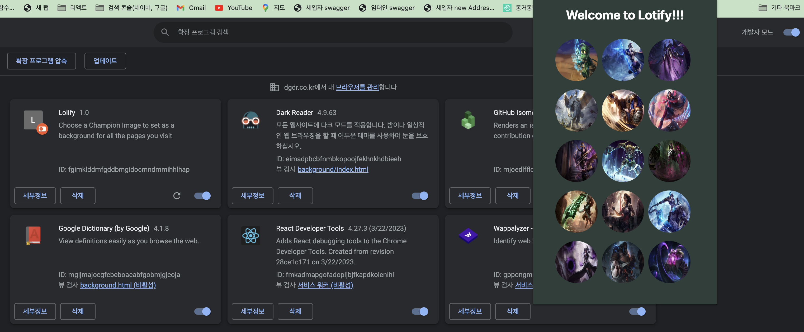
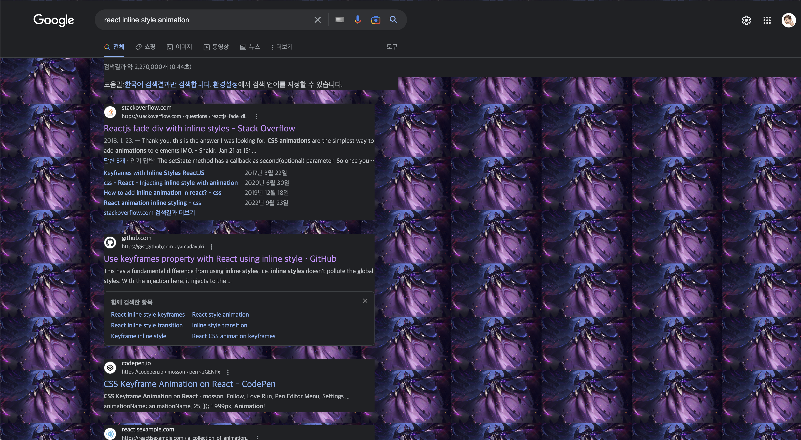

# 크롬 익스텐션 간단하게 개발 👨🏻‍🏫

## 종류

### 1. Pop up Extension 🖼️
- 크롬에서 우측 상단의 퍼즐 아이콘을 누르면 출현하는 팝업 형태의 익스텐션이다.
- html, css, js를 사용하는 미니 웹 페이지라고 생각하면 된다.
- 유저가 웹 페이지를 벗어나지 않아도 특정 기능이나 정보에 빠르게 접근 가능.

</br>

### Pop up Extension 의 예시 
1. 기사나 동영상을 저장해서 나중에 오프라인에서도 읽거나 볼 수 있는 익스텐션 앱
[](https://chrome.google.com/webstore/detail/save-to-pocket/niloccemoadcdkdjlinkgdfekeahmflj?hl=ko)

</br>

### 2. Code Injecting Extension 🔫
- JS, CSS, HTML을 사용해서 현재 동작 중인 웹 페이지의 콘텐츠나 동작을 수정한다.
- 웹 사이트의 기능을 커스터마이즈 하고 향상 시킬 수 있다!
- 외부 API 와 결합 가능


### Code Injecting Extension 의 예시 
1. 웹 사이트의 광고를 차단해줌

[](https://chrome.google.com/webstore/detail/adblock-%E2%80%94-best-ad-blocker/gighmmpiobklfepjocnamgkkbiglidom?hl=ko)


</br>
</br>


## 필요한 파일 📁

## 1. manifest.json
- 브라우저에 익스텐션 앱의 내용을 알려준다.
- 권한을 요청한다.
- 삽입할 코드를 등록한다.
- 익스텐션의 메타 정보들을 제공하는 json 파일이라고 생각하면 된다.

```json
{
  "manifest_version" : 3,
  "name" : "Lolify",
  "description": "Choose a Champion Image to set as a background for all the pages you visit",
  "version" : "1.0",
  "icons" : {
    "16" : "images/cute.jpg"
  },
  "action" : {
    "default_icon" : "images/cute.jpg",
    "default_title" : "Lolify",
    "default_popup" : "popup/popup.html"
  },
  "permissions" : ["storage"],
  "content_scripts" : [{
    "matches" : ["<all_urls>"],
    "js" : ["scripts/inject.js"]
  }]
}
```

### 주요 속성

- `manifest_version` : 크롬 익스텐션 버전이다. 2, 3이 존재하는데 3을 사용했다.
- `version` : 현재 내가 만들려는 확장 프로그램의 버전이다.
- `icons` : 확장 프로그램의 아이콘이다. 사이즈가, 16, 32, 64, 128px 존재한다.
- `action`: chrome.action에 접근하기 위해서 작성해줘야 하는 것들 프로퍼티는 optional 이다. 현재에서는 팝업을 구성하는 popup.html을 작성해주었다.
- `permissions`: chorme API를 활용하기 위해서 허용할 범위를 설정해준다.
- `content_scripts` : 실제로 웹페이지에서 실행시킬 스크립트에 대한 정보가 들어 온다. `matches`는 특정 url 인 웹페이지에서만 실행하고 싶을때 정규식을 사용하여 표현해 줄 수 있다. `js`프로퍼티는 구동시킬 자바스크립트 파일의 위치이다.


## 2. popup.html
```html
<!DOCTYPE html>
<html lang="ko-KR">
<head>
  <meta charset="UTF-8">
  <meta http-equiv="X-UA-Compatible" content="IE=edge">
  <meta name="viewport" content="width=device-width, initial-scale=1.0">
  <title>Document</title>
  <style>
    /* ...스타일 */
  </style>
</head>
<body>
  <main>
    <h1>Welcome to Lotify!!!</h1>
    <div>
      
      
      
      <!-- 여러가지 이미지들 -->
    </div>
  </main>
  <script src='popup.js'></script>
</body>
</html>
```
간단하게 여러개의 이미지가 들어가 있는 페이지를 구성하였다.

 
</br>
</br>

## 3. popup.js
```javascript

const images = Array.from(document.querySelectorAll('img'));

images.forEach((image) => image.addEventListener('click', ()=>{
  // 이미지 src를 브라우저의 저장소에 저장한다.
  chrome.storage.local.set({image : image.src})
}))
```
이미지를 클릭했을때, 유저 컴퓨터 디스크에 이미지를 key : value 타입으로 저장을 하는 코드이다.
</br>
</br>

## 4.inject.js
```javascript
chrome.storage.local.get(["image"], async function(result) {
  if(result.image){
    document.body.style.backgroundImage = `url(${result.image})`;
    document.body.style.backgroundSize = `200px`;
    document.body.style.backgroundRepeat = "repeat"
  }
})
```
대망의 실제 웹페이지에 주입되는 스크립트이다!. 웹 페이지에 들어갔을때 저장 되있는 이미지의 키에 해당하는 이미지 src를 웹 페이지의 body에 background 속성으로 바꿔준다.
</br>
</br> 

### 결과 (혐 주의...)
 


---

## 느낀점
기능은 굉장히 단순했지만 크롬 익스텐션을 어떻게 만들고, 무슨 파일들이 필요한지 알게 되었다. 더 복잡한 기능들은 공부해 봐야겠지만.... chrome API, web API가 제공하는 API들을 사용하면 정말 무궁무진한 익스텐션을 만들 수 있을 것 같다.